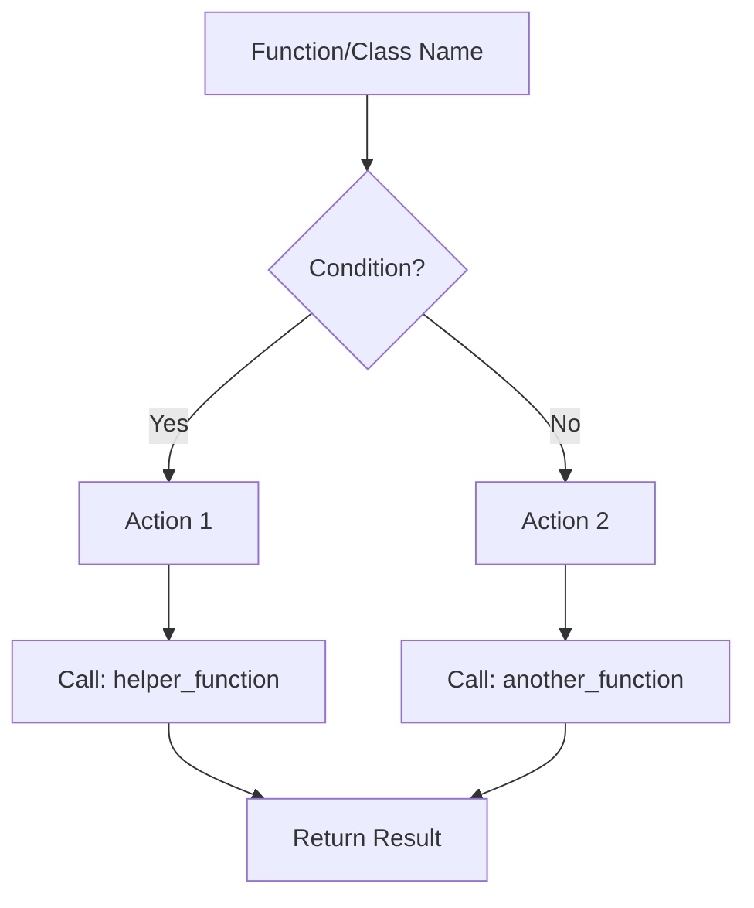
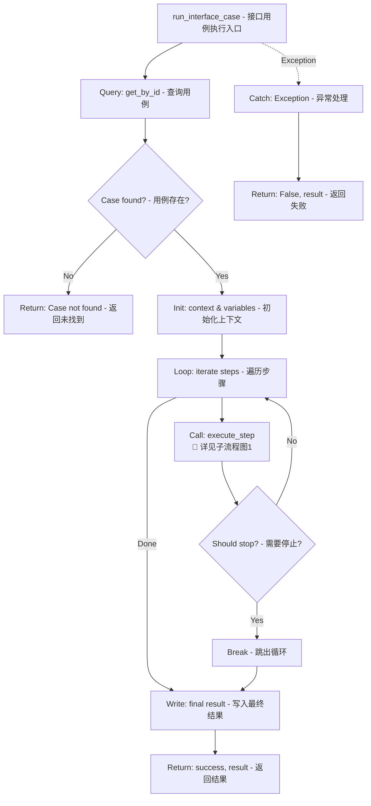
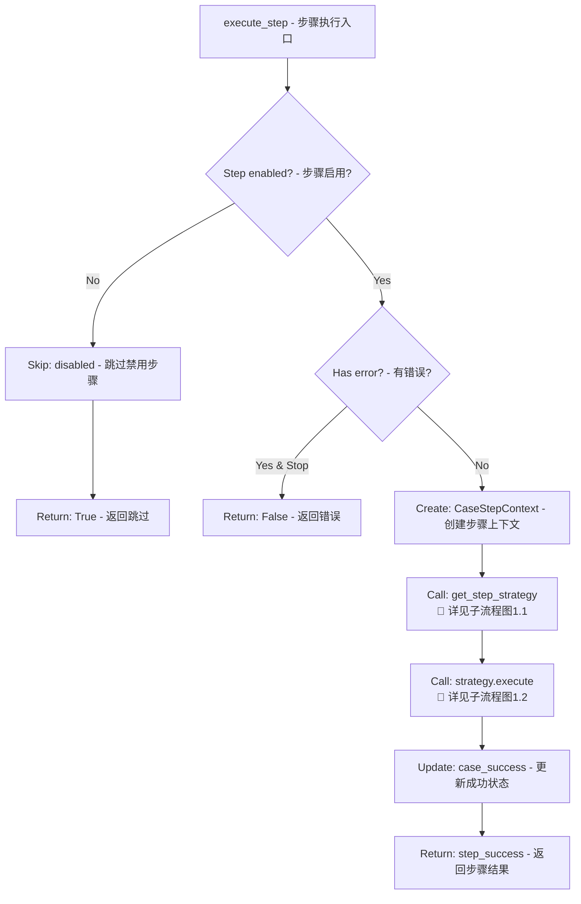
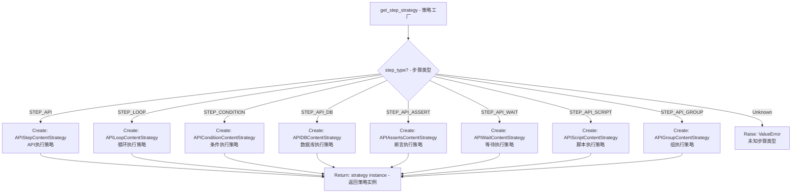
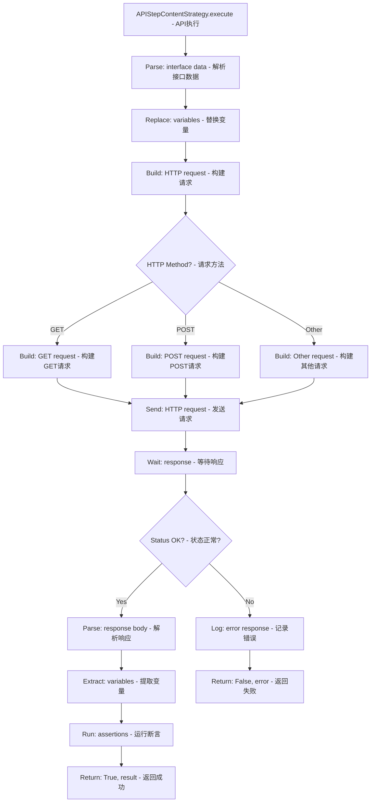
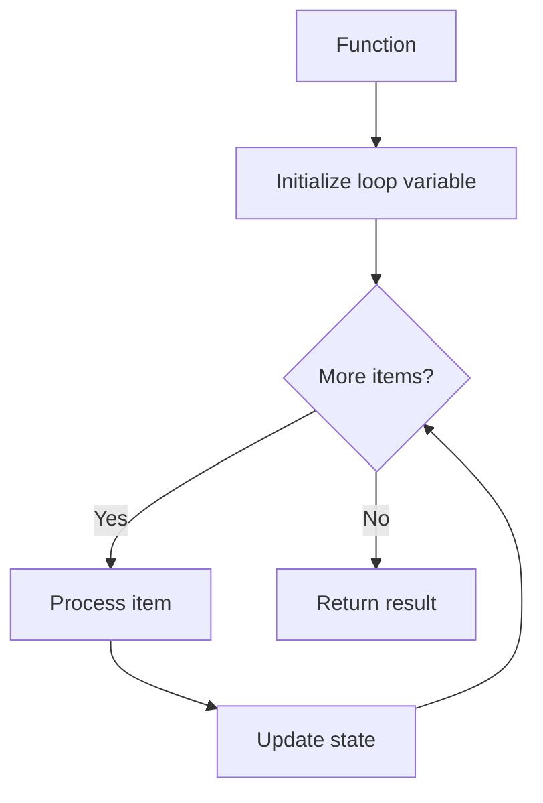
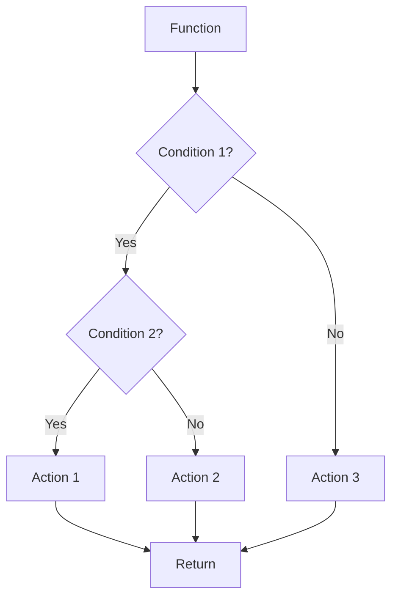
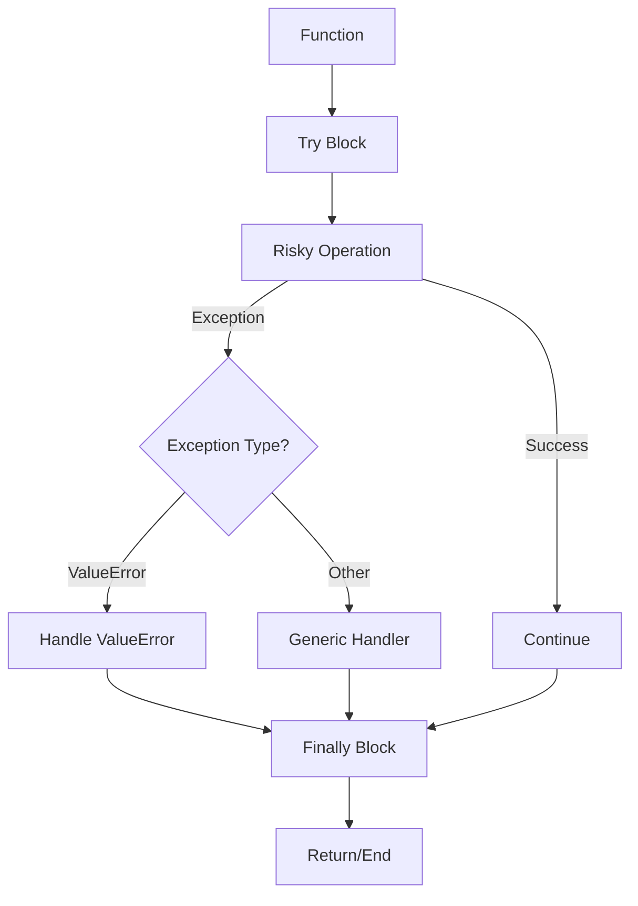
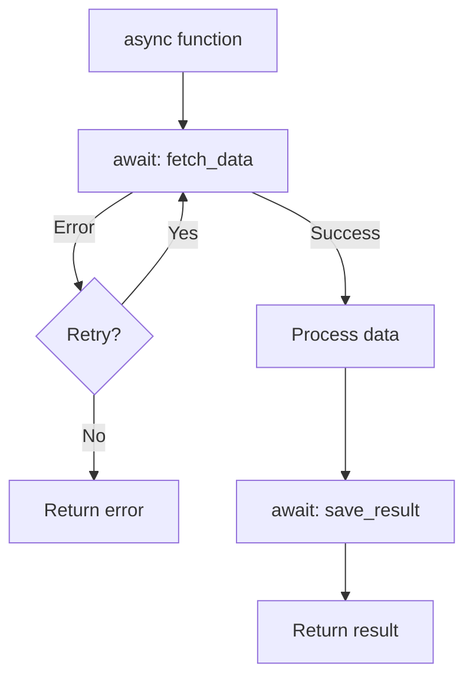
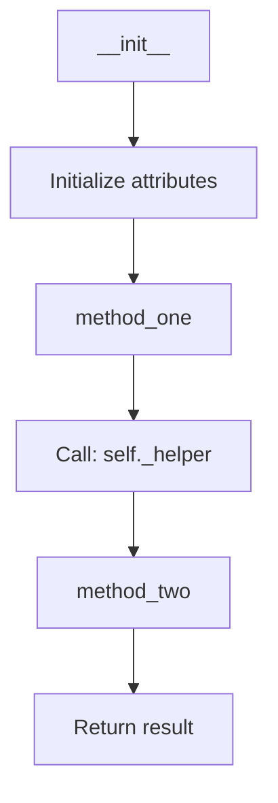

# Code Reviewer Skill

This skill performs comprehensive code quality analysis following strict evaluation standards across 8 dimensions, prioritized by severity and impact.

## Input Types

This skill accepts three types of input:

1. **Directory Path**: Review all code files in a specified directory
2. **Single File Path**: Review a specific code file
3. **Code Snippet**: Review directly provided code text

## Review Process

### Step 1: Input Analysis

First, identify the input type:
- If input is a directory path, use Glob and LS tools to find all code files
- If input is a file path, read the file content
- If input is code text, analyze it directly

### Step 2: Code Structure Analysis

Before generating the flow diagram, analyze the code structure:

1. **Identify Entry Points**:
   - Main functions/methods
   - Public API endpoints
   - Event handlers
   - Class constructors

2. **Map Call Hierarchy**:
   - List all function/method calls
   - Identify external dependencies
   - Note async operations
   - Track database/API calls

3. **Identify Control Flow**:
   - Conditional statements (if/elif/else)
   - Loops (for/while)
   - Exception handling (try/except/finally)
   - Early returns and breaks

4. **Analyze Data Flow**:
   - Input parameters
   - Return values
   - Variable transformations
   - State changes

### Step 2.1: Deep Code Analysis (Critical - Must Do)

**IMPORTANT**: Simply analyzing the current file is NOT sufficient. You MUST dive deep into the actual implementation of key logic.

For any key function call or method invocation, you MUST trace into the implementation to understand the actual business logic:

1. **Identify Key Logic Points**:
   - Look for function/method calls that contain the core business logic
   - These are typically:
     - Factory functions or strategy patterns (e.g., `get_step_strategy()`)
     - Core execution methods (e.g., `execute()`, `run()`, `process()`)
     - Data processing functions
     - External service calls
   - **DO NOT just note the call exists** - you MUST understand WHAT it does

2. **Trace Into Implementation**:
   - For each key function call, read the actual implementation
   - Understand the algorithm and business logic inside
   - Identify the critical path that affects the main functionality
   - For example: if you see `strategy.execute()`, you MUST read:
     - The strategy interface/base class
     - The concrete implementation of the execute method
     - All the steps within execute() that perform the actual work

3. **Cross-File Analysis**:
   - Key business logic often spans multiple files
   - You MUST follow the call chain to understand the full picture
   - Example:
     - `runner.py` calls `get_step_strategy()` → READ `step_content/__init__.py`
     - `get_step_strategy()` returns a strategy → READ the strategy's `execute()` method
     - The execute method may call other services → Continue tracing

4. **Understand Context and Relationships**:
   - How does this code interact with other modules?
   - What are the dependencies?
   - What is the data flow?
   - What are the side effects?

**Example of Deep Analysis**:

Given this code in `runner.py`:
```python
strategy = get_step_strategy(step_content.content_type, self.interface_executor)
step_success = await strategy.execute(step_context)
```

**What the shallow analysis does** (WRONG):
- "Calls get_step_strategy to get a strategy, then executes it"
- This is just describing what the code does, NOT analyzing the logic

**What the deep analysis should do** (CORRECT):
1. Find `get_step_strategy` definition → It's a factory in `step_content/__init__.py`
2. It maps `step_type` to 8 different strategy classes
3. For each strategy class, find its `execute()` method
4. Understand what each strategy does:
   - APIStepContentStrategy: executes HTTP API calls
   - APIConditionContentStrategy: handles conditional logic branching
   - APILoopContentStrategy: handles iteration
   - etc.
5. Trace the actual execution flow inside execute()
6. Identify the critical business logic paths

**Output Requirement**:
Your review report MUST include:
1. Identification of key logic points in the reviewed file
2. For each key point, a summary of the actual implementation (NOT just the call)
3. Cross-file call chain analysis
4. The flow diagram should show the expanded logic, not just "Call: xxx"

### Step 3: Generate Flow Diagram

Create a comprehensive Mermaid flowchart that visualizes the code execution:

**For Single Function Review**:
- Start with function name and parameters
- Show all execution paths
- Include error handling branches
- Mark external calls clearly

**For Class Review**:
- Show class initialization
- Map method interactions
- Indicate inheritance relationships
- Show state management

**For File/Module Review**:
- Identify main entry points
- Show module-level interactions
- Map import dependencies
- Highlight critical paths

### Step 4: Execute Review by Priority

Review code following this strict priority order:

**Priority 1: Security Issues** (Critical - Must fix before deployment)
**Priority 2: Functionality Defects** (High - Core functionality problems)
**Priority 3: Performance Issues** (Medium - Affects system performance)
**Priority 4: Readability Issues** (Low - Affects development efficiency)
**Priority 5: Style & Standards** (Lowest - Code consistency)

## Evaluation Dimensions

### 1. Functionality Correctness (Core Dimension)

**Why this matters**: Code that doesn't work correctly defeats all other purposes. Bugs in production can cause data loss, security breaches, and user frustration.

Review checklist:
- **Code Execution**: Can the code run without errors? Does it implement expected functionality?
- **Logic Correctness**: Does the implementation match product requirements and specifications?
- **Boundary Conditions**: Check handling of:
  - Null/empty values
  - Zero values
  - Negative numbers
  - Extra-long strings
  - Array/list out-of-bounds
  - Edge cases specific to the domain
- **Exception Handling**: Verify proper handling of:
  - Network request failures
  - Database errors
  - Permission denied scenarios
  - File I/O errors
  - Third-party service failures
- **Resource Issues**: Detect potential:
  - Infinite loops
  - Deadlocks
  - Memory leaks
  - File handle leaks
  - Connection pool exhaustion
- **Test Coverage**: Assess:
  - Unit test completeness
  - Integration/API test coverage
  - Edge case testing
  - Error path testing

**Common issues to look for**:
- Missing null checks before accessing object properties
- Incorrect loop conditions that could cause infinite loops
- Missing error handling for async operations
- Incorrect boolean logic in conditions
- Missing validation for user inputs

### 2. Security Assessment (Online Risk Priority)

**Why this matters**: Security vulnerabilities can lead to data breaches, unauthorized access, and system compromise. These issues must be identified and fixed before code reaches production.

Review checklist:
- **Injection Vulnerabilities**:
  - SQL injection: Check if user input is properly sanitized in database queries
  - XSS (Cross-Site Scripting): Verify output encoding and input validation
  - CSRF (Cross-Site Request Forgery): Check for anti-CSRF tokens
  - Command injection: Verify shell command sanitization
  - Path traversal: Check file path validation
- **Access Control**:
  - Verify API endpoint permission checks
  - Ensure regular users cannot access admin endpoints
  - Check for proper authentication on sensitive operations
  - Verify role-based access control (RBAC) implementation
- **Sensitive Data Protection**:
  - Passwords: Must be hashed (bcrypt, argon2), never stored in plain text
  - Phone numbers, ID cards: Should be encrypted or masked
  - API keys, tokens: Should not be hardcoded, use environment variables
  - Verify HTTPS for data transmission
- **Logging Security**:
  - Ensure passwords are never logged
  - Tokens and session IDs should be masked or excluded
  - Sensitive personal information should be redacted
- **Input Validation**:
  - File upload: Check file type, size limits, virus scanning
  - API parameters: Validate type, length, format, range
  - Check for mass assignment vulnerabilities

**Common issues to look for**:
- String concatenation in SQL queries instead of parameterized queries
- Missing authentication checks on sensitive endpoints
- Logging full request bodies including passwords
- Hardcoded credentials in source code
- Missing input validation on user-provided data

### 3. Performance & Resource Analysis

**Why this matters**: Poor performance leads to slow user experience, increased infrastructure costs, and system instability under load.

Review checklist:
- **Database Operations**:
  - N+1 query problem: Check for queries inside loops
  - Missing database indexes on frequently queried fields
  - Unnecessary SELECT * queries
  - Missing pagination for large result sets
- **API Calls**:
  - Repeated API calls in loops
  - Missing caching for frequently accessed data
  - Sequential calls that could be parallelized
- **Computation**:
  - Unnecessary complex calculations
  - Redundant computations that could be cached
  - Inefficient algorithms (O(n²) or worse)
- **Resource Management**:
  - Memory: Check for proper cleanup of large objects
  - File handles: Ensure files are properly closed (use context managers)
  - Network connections: Verify connection pooling and proper closure
  - Database connections: Check for connection leaks
- **Caching**:
  - Identify opportunities for caching
  - Check cache invalidation logic
  - Verify cache key design

**Common issues to look for**:
- Database queries inside for loops
- Loading all records into memory instead of streaming/pagination
- Missing connection pooling
- Not using prepared statements (performance + security)
- Expensive operations in frequently called functions

### 4. Code Readability & Maintainability

**Why this matters**: Code is read far more often than it's written. Poor readability leads to bugs during maintenance and slows down team productivity.

Review checklist:
- **Naming Quality**:
  - Variables: Should be descriptive and indicate purpose (avoid `a`, `b`, `temp`, `data`)
  - Functions: Should be verbs or verb phrases indicating action
  - Classes: Should be nouns representing the concept
  - Constants: Should be UPPER_CASE or descriptive
  - Boolean variables: Should be questions (`isValid`, `hasPermission`)
- **Function Design**:
  - Single Responsibility Principle: Each function should do one thing well
  - Function length: Generally under 50 lines, complex logic may need extraction
  - Parameter count: Generally under 4-5 parameters
  - Avoid deep nesting (more than 3 levels)
- **Comments**:
  - Business logic: Should explain WHY, not just WHAT
  - Complex algorithms: Should have explanatory comments
  - Avoid redundant comments that just repeat the code
  - TODO comments should have issue tracker references
- **Code Structure**:
  - Clear separation of concerns
  - Logical grouping of related functions
  - Consistent file organization
- **DRY Principle**:
  - Identify duplicated code blocks
  - Check if common patterns are abstracted into reusable functions
  - Verify shared utilities are properly centralized

**Common issues to look for**:
- Single-letter variable names except for loop counters
- Functions over 100 lines
- Deep nesting (4+ levels of if/for)
- Copy-pasted code blocks
- Magic numbers without explanation

### 5. Architecture & Design Compliance

**Why this matters**: Good architecture makes code easier to understand, test, and modify. Poor architecture leads to tightly coupled code that's hard to change.

Review checklist:
- **Architecture Patterns**:
  - Verify code follows project architecture (MVC, microservices, layered, etc.)
  - Check separation of concerns (presentation, business logic, data access)
  - Verify dependency direction (dependencies should point inward/downward)
- **Coupling Analysis**:
  - Identify high-coupling modules that could cause "change one, break many"
  - Check for circular dependencies
  - Verify interface-based dependencies for flexibility
- **Extensibility**:
  - Assess how easy it is to add new features
  - Check for hardcoded assumptions that limit flexibility
  - Verify use of design patterns where appropriate
- **Code Reuse**:
  - Check if common logic is centralized
  - Verify shared utilities are properly abstracted
  - Identify opportunities for better abstraction

**Common issues to look for**:
- Business logic in controllers
- Database queries in UI layer
- Circular dependencies between modules
- Hardcoded configuration values
- Missing abstraction layers

### 6. Coding Standards & Style Consistency

**Why this matters**: Consistent code style reduces cognitive load and makes code easier to scan and understand for the entire team.

Review checklist:
- **Formatting**:
  - Consistent indentation (spaces vs tabs, 2 vs 4 spaces)
  - Consistent spacing around operators
  - Consistent line breaks and blank lines
  - Consistent brace style
- **Naming Conventions**:
  - camelCase vs snake_case consistency
  - Class names: PascalCase
  - Constants: UPPER_SNAKE_CASE or PascalCase
  - Private members: _leadingUnderscore or no prefix
- **Lint Compliance**:
  - Run project lint tools if available
  - Address lint warnings and errors
- **Dead Code**:
  - Identify unused imports
  - Find commented-out code (should be removed)
  - Locate debug code (console.log, print statements)
  - Find unreachable code

**Common issues to look for**:
- Mixed indentation styles
- Inconsistent naming conventions
- Leftover debug print statements
- Commented-out code blocks
- Unused imports

### 7. Compatibility & Robustness

**Why this matters**: Code needs to work across different environments and handle unexpected situations gracefully.

Review checklist:
- **Multi-Environment Support**:
  - Multi-language support (internationalization)
  - Multi-device compatibility (responsive design)
  - Multi-browser compatibility (for frontend code)
- **Error Tolerance**:
  - Empty data handling
  - Malformed data handling
  - Unexpected type handling
  - Graceful degradation
- **Dependency Management**:
  - Check for deprecated library usage
  - Verify version compatibility
  - Check for breaking changes in dependencies
- **Fallback Mechanisms**:
  - Circuit breaker patterns for external services
  - Default values for missing configuration
  - Retry logic with exponential backoff
  - Graceful degradation when features are unavailable

**Common issues to look for**:
- Missing null/undefined checks
- No error boundaries for component failures
- Hard timeouts without retry logic
- Missing feature flags for gradual rollout
- No fallback for external service failures

### 8. Business Logic Accuracy

**Why this matters**: Even technically correct code can be wrong if it doesn't match business requirements. Understanding the business context is crucial.

Review checklist:
- **Financial Calculations**:
  - Verify correct decimal precision for money
  - Check rounding logic
  - Verify currency conversion logic
  - Check for floating-point precision issues
- **State Transitions**:
  - Verify state machine logic
  - Check for invalid state transitions
  - Verify concurrent state handling
- **Business Rules**:
  - Verify implementation matches business requirements
  - Check for missing business rule validations
  - Verify edge cases specific to the business domain
- **Requirement Understanding**:
  - Identify logic that might indicate misunderstanding of requirements
  - Check for over-engineering beyond requirements
  - Verify all acceptance criteria are met

**Common issues to look for**:
- Using float for money instead of decimal
- Missing business rule validations
- Incorrect state transition logic
- Over-engineered solutions
- Missing edge case handling specific to domain

## Code Flow Diagram Generation

**Why this matters**: Visualizing code execution flow helps developers quickly understand the logic and identify potential issues. A flow diagram provides a clear overview of how code components interact.

### Flow Diagram Requirements

Before generating the review report, ALWAYS create a comprehensive flow diagram that:

1. **Starts with the reviewed object**: The top node should be the main function/class being reviewed
2. **Shows all branch paths**: Include all conditional branches, loops, and error handling paths
3. **Includes call relationships**: Show which functions/methods are called and their purposes
4. **Indicates data flow**: Show how data moves through the code
5. **Marks decision points**: Clearly indicate where the code makes decisions (if/else, try/except, etc.)
6. **Hierarchical Structure (IMPORTANT)**: Use a two-level diagram approach:
   - **Main Flow Diagram**: Shows the overall flow at a high level, keeping it clear and readable
   - **Sub Flow Diagrams**: For complex function/method calls, create separate detailed diagrams

### Hierarchical Flow Diagram Design

**When to Create Sub Flow Diagrams**:

Create a separate sub flow diagram when a function/method call meets ANY of these criteria:
1. **High Complexity**: The function contains multiple conditional branches (3+ if/else)
2. **Deep Logic**: The function has nested logic (loops within conditionals, etc.)
3. **Multiple Paths**: The function has distinct execution paths based on different conditions
4. **External Dependencies**: The function calls other complex functions that need explanation
5. **Business Critical**: The function is central to the business logic being reviewed

**Main Flow Diagram Rules**:
- Keep it at a HIGH LEVEL - show the main flow, not every detail
- Use "Call: function_name" nodes for complex function calls
- Add a reference marker like `[详见子流程图X]` or `[See Sub-Flow X]` for functions with sub diagrams
- Focus on the overall structure and key decision points
- Maximum 15-20 nodes to maintain readability

**Sub Flow Diagram Rules**:
- Start with the function name and its parameters
- Show ALL internal logic: conditionals, loops, error handling
- Include calls to other functions (can reference further sub-diagrams if needed)
- Use detailed node names with Chinese comments
- No limit on nodes - show the complete logic

**Diagram Reference Format**:

In the main flow diagram, mark complex calls with sub-diagram references:
```
CallFunc[Call: get_step_strategy - 获取步骤执行策略<br/>📄 详见子流程图1]
```

Or use a note:
```
CallFunc[Call: strategy.execute - 执行步骤]
Note1[📄 详细逻辑见子流程图2: strategy.execute]
CallFunc --> Note1
```

### Flow Diagram Format

Use Mermaid flowchart syntax for the diagram:



### Flow Diagram Standards

1. **Node Naming with Chinese Comments**:
   - Use descriptive names for nodes
   - **ALWAYS add Chinese comments** to explain the purpose of each node
   - Format: `NodeName[English Name - 中文说明]`
   - Include function/method names in call nodes
   - Add brief descriptions for complex operations

   **Example**:
   ```mermaid
   flowchart TD
       Start[run_interface_case - 接口用例执行入口] --> GetCase[Query: get_by_id - 查询用例数据]
       GetCase --> Check{Case found? - 用例是否存在}
       Check -->|Yes| Process[Process case - 处理用例逻辑]
       Check -->|No| Error[Return error - 返回错误信息]
   ```

2. **Branch Indicators**:
   - Use `-->|label|` to label branches
   - **Use bilingual labels**: English + Chinese
   - Format: `-->|Yes/是|` or `-->|Success/成功|`
   - Use clear, concise labels
   - Color-code critical paths if needed

3. **Call Relationships**:
   - Prefix called functions with "Call:"
   - **Add Chinese description**: `Call: function_name - 功能说明`
   - Include module/class name if relevant
   - Show async calls with "await" indicator

4. **Error Handling**:
   - Show try/except blocks explicitly
   - Include error paths and recovery logic
   - Mark exception types in decision nodes
   - **Add Chinese comments for error scenarios**

### Example Flow Diagram with Chinese Comments

**Example: Hierarchical Flow Diagram for `run_interface_case`**

#### 主流程图 (Main Flow Diagram)

The main flow diagram shows the HIGH-LEVEL structure:



#### 子流程图1: execute_step (Sub Flow Diagram 1)

Detailed logic for step execution:



#### 子流程图1.1: get_step_strategy (Sub Flow Diagram 1.1)

Factory function for strategy selection:



#### 子流程图1.2: APIStepContentStrategy.execute (Sub Flow Diagram 1.2)

Detailed API execution logic:



### Key Points for Hierarchical Diagrams

1. **Main diagram** stays clean and readable (15-20 nodes max)
2. **Sub diagrams** provide detailed logic for complex functions
3. **Reference markers** (`📄 详见子流程图X`) clearly link main and sub diagrams
4. **Each sub diagram** is self-contained and can be understood independently
5. **Cross-file logic** is shown in appropriate sub diagrams

### Handling Complex Code Patterns

#### 1. Loops and Iterations

For loops and iterations, show the iteration logic:



#### 2. Nested Conditionals

For nested if-else statements, use clear indentation:



#### 3. Exception Handling

Show try/except/finally blocks explicitly:



#### 4. Async Operations

Mark async operations clearly:



#### 5. Class Methods Interaction

Show how methods interact within a class:



### Flow Diagram Best Practices

1. **Keep it Readable**:
   - Limit diagram width to 3-4 nodes
   - Use subgraphs for complex logic
   - Break large diagrams into multiple sections

2. **Be Consistent**:
   - Use the same node shapes for similar operations
   - Maintain consistent arrow styles
   - Use uniform naming conventions

3. **Focus on Important Paths**:
   - Highlight the main execution path
   - Show error paths clearly
   - Don't include every trivial operation

4. **Add Context**:
   - Include parameter names where relevant
   - Show return types
   - Note side effects (logging, DB writes, etc.)

## Output Format

ALWAYS use this exact structure for the review report:

```markdown
# Code Review Report

## Code Execution Flow Diagram

```mermaid
flowchart TD
    [Generate comprehensive flow diagram showing the execution flow of the reviewed code]
```

**Flow Diagram Legend**:
- Rectangular nodes: Actions/Operations
- Diamond nodes: Decision points
- Rounded nodes: Start/End points
- Arrows with labels: Branch conditions

## Executive Summary
[Brief overview of overall code quality and most critical issues]

## Critical Issues (Must Fix)

### Security Issues
[List all security vulnerabilities with severity and fix recommendations]

### Functionality Defects
[List all functionality problems that prevent correct operation]

## Important Issues (Should Fix)

### Performance Problems
[List performance issues with impact assessment]

### Readability Concerns
[List significant readability issues affecting maintenance]

## Minor Issues (Nice to Fix)

### Style & Standards
[List style inconsistencies and standard violations]

### Compatibility & Robustness
[List compatibility and robustness improvements]

## Detailed Analysis

### [File/Component Name]
[Detailed analysis for each file or component reviewed]

### Cross-File Analysis (IMPORTANT)
[Analysis of how the reviewed code interacts with other files/modules]
- **Key Dependencies**: List the critical external dependencies
- **Call Chain Analysis**: Trace the key function calls to their implementations
- **Implementation Details**: Summarize the actual logic in dependent files
- **Data Flow**: How data flows across files

## Actionable Recommendations

**IMPORTANT**: This section provides ready-to-execute code modifications. AI assistants reading this document should be able to directly apply these changes.

### High Priority Fixes (Must Apply)

#### Fix 1: [Issue Title]
**File**: [file_path]  
**Line**: [line_number]  
**Priority**: Critical  
**Issue**: [Brief description of the problem]

**Original Code**:
```python
[Original problematic code]
```

**Modified Code**:
```python
[Corrected code with fixes applied]
```

**Explanation**: [Why this change is needed and what it fixes]

**How to Apply**:
1. Locate the code at line [X] in [file_path]
2. Replace the original code block with the modified code
3. Verify the change doesn't break existing functionality
4. Run tests to confirm the fix

---

#### Fix 2: [Issue Title]
[Same format as Fix 1]

### Medium Priority Fixes (Should Apply)

#### Fix 3: [Issue Title]
[Same format as above]

### Low Priority Fixes (Nice to Apply)

#### Fix 4: [Issue Title]
[Same format as above]

## Implementation Checklist

For AI assistants applying these fixes:

- [ ] Review all High Priority Fixes
- [ ] Apply Fix 1: [Issue Title]
- [ ] Apply Fix 2: [Issue Title]
- [ ] Test the changes
- [ ] Review Medium Priority Fixes
- [ ] Apply selected Medium Priority fixes
- [ ] Run full test suite
- [ ] Verify no regressions

## Metrics Summary
- Files Reviewed: [count]
- Critical Issues: [count]
- Important Issues: [count]
- Minor Issues: [count]
- Overall Quality Score: [1-10]
- Fixes Provided: [count of actionable fixes]
```

## Fix Format Standards

When providing fixes, ALWAYS follow this structure:

### 1. Clear Identification
- **File**: Absolute path to the file
- **Line**: Exact line number(s)
- **Priority**: Critical/High/Medium/Low
- **Issue**: One-sentence problem description

### 2. Code Comparison
- Show the **Original Code** exactly as it appears
- Show the **Modified Code** with all fixes applied
- Use proper syntax highlighting
- Include sufficient context (not just the changed line)

### 3. Explanation
- Explain WHY the change is needed
- Explain WHAT the change fixes
- Mention any potential side effects
- Note any dependencies or prerequisites

### 4. Application Steps
- Provide step-by-step instructions
- Include verification steps
- Mention testing requirements
- Note any configuration changes needed

### Example Fix Format

```markdown
#### Fix 1: Add Null Check for Database Query Results
**File**: /path/to/file.py  
**Line**: 67-68  
**Priority**: Critical  
**Issue**: Missing null check after database query can cause AttributeError

**Original Code**:
```python
interface = await InterfaceMapper.get_by_id(ident=interface_id)
env = await EnvMapper.get_by_id(ident=env_id)
result, success = await self.interface_executor.execute(
    interface=interface, env=env
)
```

**Modified Code**:
```python
interface = await InterfaceMapper.get_by_id(ident=interface_id)
if not interface:
    raise ValueError(f"Interface with id {interface_id} not found")

env = await EnvMapper.get_by_id(ident=env_id)
if not env:
    raise ValueError(f"Environment with id {env_id} not found")

result, success = await self.interface_executor.execute(
    interface=interface, env=env
)
```

**Explanation**: 
- The original code doesn't check if the database query returns None
- This can cause AttributeError when trying to use the None object
- The fix adds explicit null checks with descriptive error messages
- This prevents silent failures and makes debugging easier

**How to Apply**:
1. Open `/path/to/file.py` and navigate to line 67
2. Replace the 5-line code block with the 11-line modified version
3. Ensure the ValueError import is present at the top of the file
4. Run unit tests to verify the error handling works correctly
5. Test with invalid IDs to confirm proper error messages are raised
```

## Review Principles

1. **Deep Analysis First**: DO NOT just describe what the code does. You MUST understand and explain the actual implementation logic, especially for key business functions. Trace into dependent files to understand the full picture.
2. **Severity First**: Always prioritize issues by their potential impact on the system
3. **Be Specific**: Provide exact file paths, line numbers, and code snippets for issues
4. **Explain Why**: Always explain why something is a problem, not just that it is one
5. **Provide Solutions**: Don't just identify problems, suggest how to fix them
6. **Consider Context**: Account for project-specific conventions and constraints
7. **Focus on What Matters**: Don't nitpick on style when there are critical security issues
8. **Cross-File Understanding**: Key logic often spans multiple files. You MUST trace the call chain and understand the implementation in dependent files.

## Important Notes

- **Never compromise on security**: Even if it's "just a demo", security issues must be flagged
- **Be thorough but practical**: Focus on issues that have real impact
- **Consider the audience**: Adjust technical depth based on who will read the review
- **Provide actionable feedback**: Every issue should have a clear path to resolution
- **Acknowledge good practices**: It's important to highlight what's done well, not just problems
