<div align="center">

# CaseHUB

### 接口 & UI 自动化测试工具

[](https://fastapi.tiangolo.com/)
[](https://www.python.org/)
[](https://www.python-httpx.org/)
[](https://playwright.dev/python/docs/api/class-playwright)
[](https://www.mysql.com/)
[](https://redis.io/)
[](LICENSE)

**接口测试** · **UI自动化** · **定时任务** · **测试报告**

</div>

---

## 目录

- [项目简介](#项目简介)
- [核心特性](#核心特性)
- [技术架构](#技术架构)
- [快速开始](#快速开始)
- [功能展示](#功能展示)
- [配置说明](#配置说明)
- [更新日志](#更新日志)
- [联系我们](#联系我)

---

## 项目简介

**CaseHUB** 是一个接口与UI自动化测试工具，主要用于测试团队进行自动化测试工作。工具集成了接口测试、UI自动化测试、定时任务调度、测试报告生成等功能，支持测试流程编排和断言验证，帮助团队提升测试效率。

### 前端项目

[前端项目地址](https://github.com/Caoyongqi912/caseHubWeb)

---

## 核心特性

### 接口自动化测试

#### 完整的 HTTP 请求支持

- 支持 HTTP 请求类型：GET、POST、PUT、DELETE
- 灵活的参数配置：URL、Header、Query、Body 等
- CURL 命令解析导入，快速生成测试用例

#### 智能变量管理

- **变量提取**：从响应数据中提取变量，支持 JSONPath、JMESPath 等多种提取方式
- **变量引用**：在后续请求中灵活引用提取的变量
- **全局变量**：跨用例、跨项目的变量共享机制
- **函数变量**：支持自定义函数生成动态变量

#### 强大的断言能力

- **状态码断言**：验证 HTTP 响应状态码
- **内容断言**：验证响应体内容，支持 JSONPath、JMESPath 表达式
- **变量断言**：验证变量值的正确性
- **SQL 断言**：验证数据库查询结果

#### 灵活的测试流程

- **前后置脚本**：在用例执行前后执行自定义 Python 脚本
- **SQL 执行**：支持在测试流程中执行 SQL 语句
- **条件判断**：根据条件动态控制测试流程
- **循环执行**：支持 LOOP 循环执行器
- **等待机制**：支持步骤等待功能

#### 业务流程编排

- 支持引用公共 API 和 API 组
- 支持添加私有 API
- 支持逻辑判断、脚本执行、等待等步骤
- 支持用例拖拽排序和复制

#### 调试与执行

- **调试模式**：逐步执行测试用例，实时查看日志
- **同步执行**：实时展示测试日志，便于问题排查
- **异步执行**：后台执行任务，支持轮询结果
- **单用例/批量执行**：灵活的执行方式

#### 定时任务与报告

- **定时任务**：基于 APScheduler 的定时任务调度
- **任务池管理**：支持任务池管理和调度
- **测试报告**：自动生成 HTML 格式测试报告
- **结果推送**：支持企业微信等多种推送方式

#### 接口录制

- 支持接口录制功能（当前版本体验不佳，待优化）

---

### UI 自动化测试

#### Playwright 集成

- 基于 Playwright 的浏览器自动化测试
- 支持 Chrome、Firefox、Safari 等主流浏览器
- 支持无头模式和运行日志可视化模式

#### 步骤管理

- **步骤录入**：可视化录入测试步骤
- **公共步骤**：创建和管理可复用的公共步骤
- **步骤拖拽**：灵活调整步骤执行顺序
- **步骤组**：支持步骤组管理，提升复用性
- **SQL 操作**：支持在 UI 测试中执行 SQL
- **脚本操作**：支持在 UI 测试中执行 Python 脚本
- **接口请求**：支持在 UI 测试中执行接口请求

#### 全局配置

- **环境配置**：支持多环境切换
- **方法配置**：自定义 UI 测试方法
- **任务调度**：支持 UI 测试任务的定时执行

---

### 测试用例管理

#### 用例生命周期管理

- **用例 CRUD**：完整的用例增删改查功能
- **用例复制**：快速复制已有用例
- **用例拖拽**：灵活调整用例顺序
- **用例关联**：关联需求，实现需求追溯

#### 用例库

- **用例库管理**：集中管理测试用例
- **动态生成**：支持用例动态生成
- **用例分类**：支持模块化用例管理

#### 脑图能力

- **Mind Map**：集成脑图功能用于测试用例编写（开发中）

> 说明：用例管理模块目前为初步版本，功能尚未完全开发，后续可能会进行重构

---

### 性能测试

#### Locust 集成

- 集成 Locust 性能测试框架
- 压测任务创建和执行
- 待完成：数据记录、断言、变量等功能

> 说明：性能测试模块目前为半成品，功能不完善，使用体验不佳，待重构

---

## 技术架构

### 技术栈

| 类别 | 技术 | 版本 |
|------|------|------|
| 后端框架 | FastAPI | 0.121.3 |
| 编程语言 | Python | 3.12+ |
| HTTP 客户端 | Httpx | 0.28.1 |
| UI 自动化 | Playwright | 1.56.0 |
| 数据库 | MySQL | 8.0+ |
| 缓存 | Redis | 7.1.0 |
| ORM | SQLAlchemy | 2.0.44 |
| 定时任务 | APScheduler | 3.10.4 |
| 异步任务 | Celery | 5.4.0 |
| 性能测试 | Locust | 2.42.5 |
| 日志 | Loguru | 0.7.3 |
| 数据验证 | Pydantic | 2.12.4 |

### 项目结构

```
case_auto_hub/
├── app/                    # 应用核心模块
│   ├── controller/         # 控制器层
│   │   ├── interface/      # 接口测试相关接口
│   │   ├── play/           # UI自动化相关接口
│   │   ├── caseHub/        # 用例管理相关接口
│   │   ├── project/        # 项目管理相关接口
│   │   └── user/            # 用户管理相关接口
│   ├── mapper/             # 数据访问层
│   ├── model/              # 数据模型
│   ├── schema/             # 数据验证 Schema
│   ├── scheduler/          # 定时任务调度
│   └── ws/                 # WebSocket 服务
├── croe/                   # 核心执行引擎
│   ├── interface/          # 接口执行引擎
│   │   ├── builder/        # 请求构建器
│   │   ├── executor/       # 执行器
│   │   └── manager/        # 管理器（断言、变量、条件等）
│   └── play/               # UI 执行引擎
├── common/                 # 公共工具
│   ├── httpxClient.py      # HTTP 客户端
│   ├── mysqlClient.py      # MySQL 客户端
│   ├── redisClient.py      # Redis 客户端
│   └── notifyManager.py     # 通知管理器
├── utils/                  # 工具类
├── enums/                  # 枚举定义
├── resource/               # 资源文件
├── script/                 # 脚本文件
├── config.py               # 配置文件
├── main.py                 # 应用入口
└── run.py                  # 启动脚本
```

---

## 快速开始

### 环境准备

#### 1. 安装依赖服务

**MySQL**

```bash
# 创建数据库
CREATE DATABASE autoHub CHARACTER SET utf8mb4 COLLATE utf8mb4_unicode_ci;
```

**Redis**

```bash
# 确保 Redis 服务已启动
redis-server
```

**Python**

```bash
# 确保 Python 版本 >= 3.12
python --version
```

#### 2. 安装项目依赖

```bash
# 克隆项目
git clone https://github.com/Caoyongqi912/case_auto_hub.git
cd case_auto_hub

# 创建虚拟环境（推荐）
python -m venv venv
source venv/bin/activate  # Windows: venv\Scripts\activate

# 安装依赖
pip install -r requirements.txt
```

#### 3. 配置文件

编辑 `config.py` 文件，根据本地环境进行配置：

```python
class LocalConfig(BaseConfig):
    # 服务器配置
    SERVER_HOST: str = "127.0.0.1"
    SERVER_PORT: int = 5050
    DOMAIN = f"http://{SERVER_HOST}:{SERVER_PORT}"

    # 任务配置
    TASK_WORKER_POOL_SIZE = 10

    # 代理录制
    Record_Proxy = False

    # MySQL 配置
    MYSQL_SERVER = "127.0.0.1"
    MYSQL_PASSWORD = "your_password"

    # Redis 配置
    REDIS_DB = 0
    REDIS_SERVER = "127.0.0.1"
    REDIS_URL: str = f"redis://{REDIS_SERVER}:{BaseConfig.REDIS_PORT}/{REDIS_DB}"

    # Oracle 客户端（可选）
    CX_Oracle_Client_Dir = "/your/instantclient_23_3"

    # UI 自动化配置
    INIT_PLAY_BROWSER = False
    UI_Headless = True
    UI_Timeout = 10000
    UI_SLOW = 500

    # 定时任务配置
    APS = False
    APS_TZ = pytz.timezone('Asia/Shanghai')
```

#### 4. 初始化数据库

执行初始化 SQL 脚本：

```bash
# 执行初始化脚本
mysql -u root -p autoHub < script/initSQL.sql
```

初始化脚本会创建默认管理员账户：

- 用户名：`admin`
- 密码：`admin123`

#### 5. 启动项目

```bash
# 使用 run.py 启动（推荐开发环境）
python run.py
```

启动成功后，访问：

- API 文档：http://127.0.0.1:5050/docs
- 前端页面：部署前端项目后访问

#### 6. 部署前端

参考 [前端项目](https://github.com/Caoyongqi912/caseHubWeb) 进行前端部署。

---

## 功能展示

### 首页数据展示

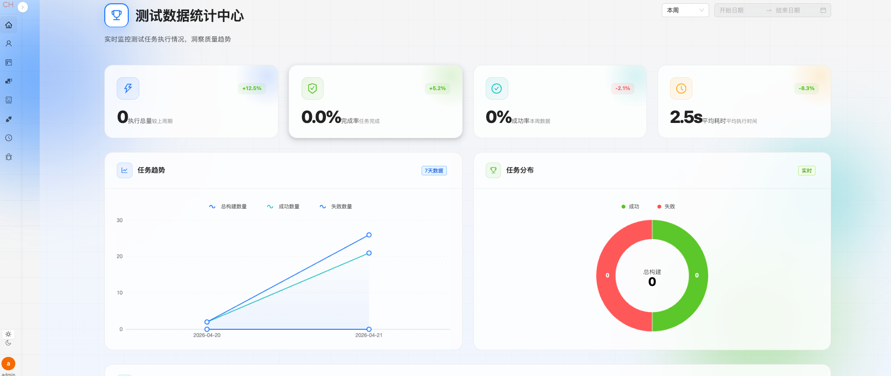

### 接口用例

展示所有接口用例的概览，支持快速筛选和搜索。

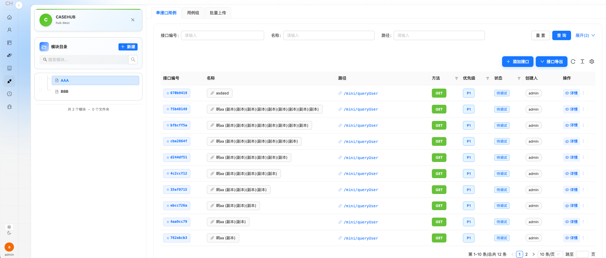

### API 详情

查看单个接口的详细信息，包括请求参数、响应示例等。

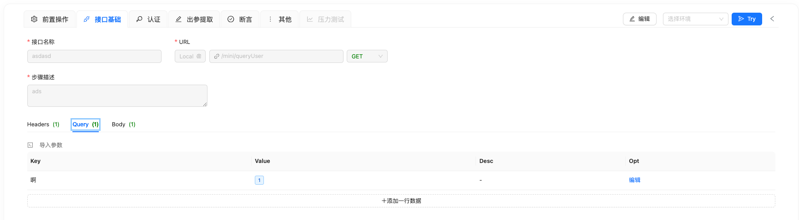

### 前置操作

#### 前置变量

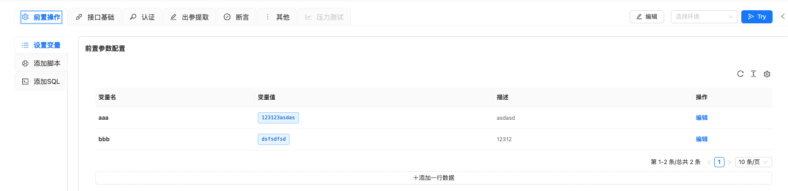

#### 前置脚本

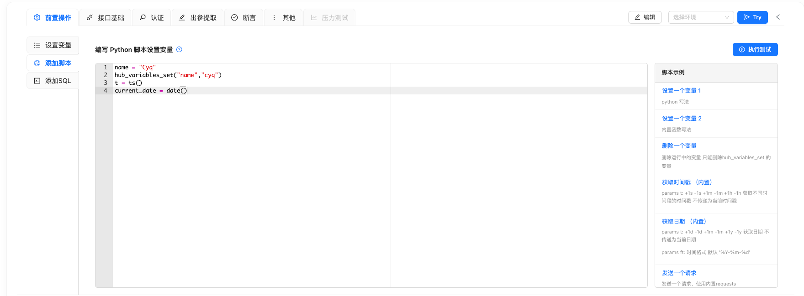

#### SQL 执行

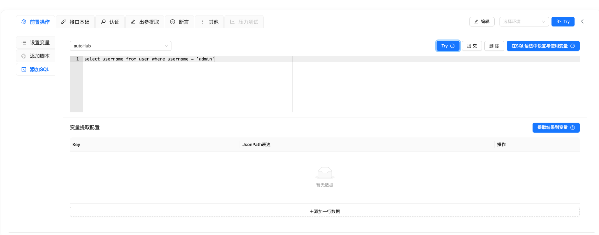

### 响应提取

从响应数据中提取变量，支持多种提取方式。

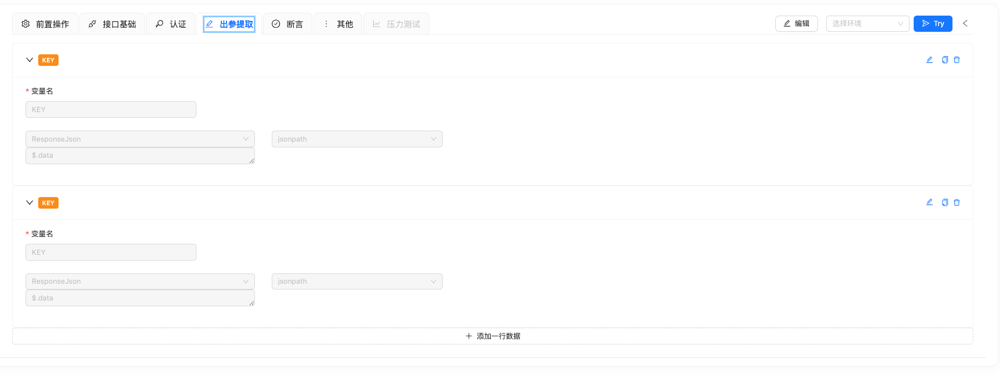

### 接口断言

强大的断言功能，支持多种断言类型。

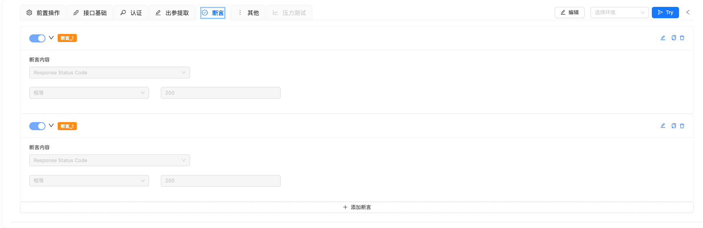

### 变量写入

支持在 URL、Header、Query、Body、SQL 中写入变量。

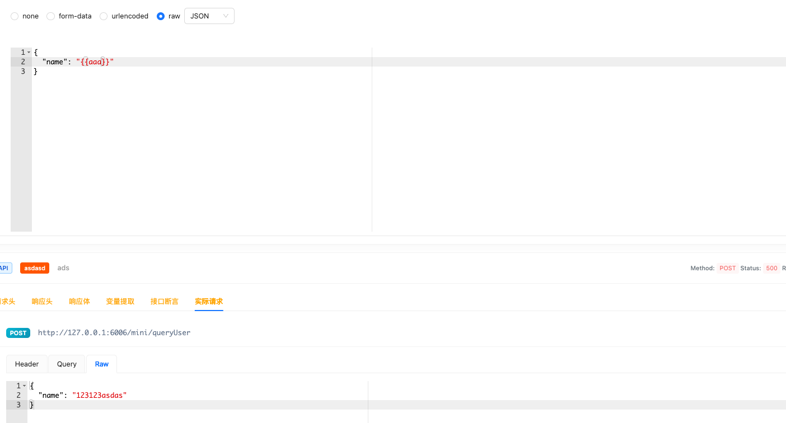

### 引用变量

可视化变量引用功能，提升用例编写效率。

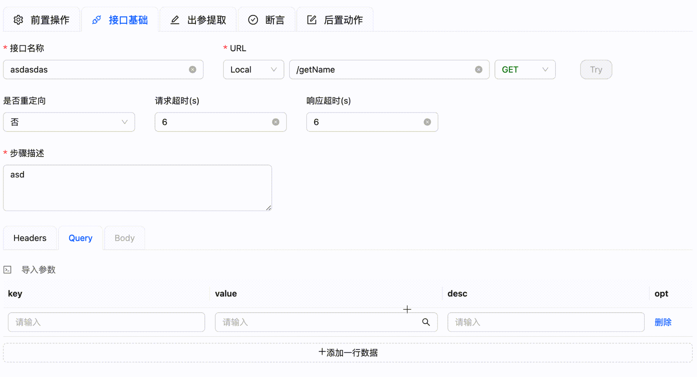

### CURL 解析导入

支持 CURL 命令解析导入，快速生成测试用例。

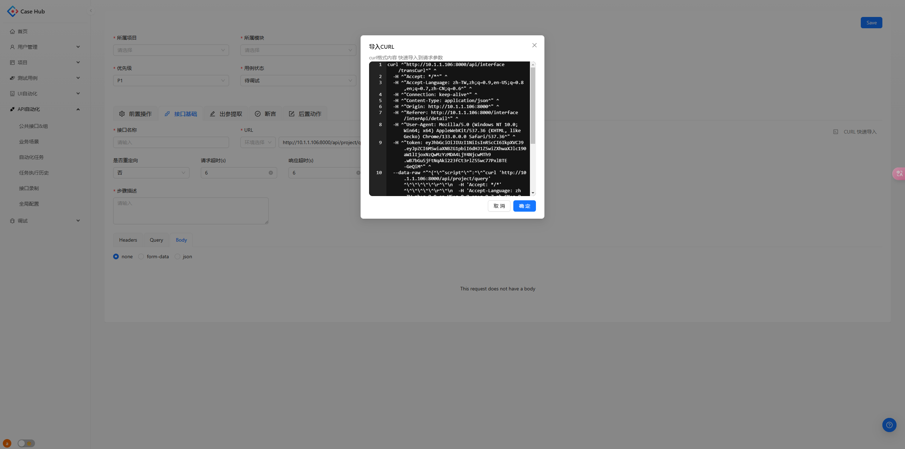

### APITry

在选择运行环境后执行接口请求，快速验证 API 可用性。

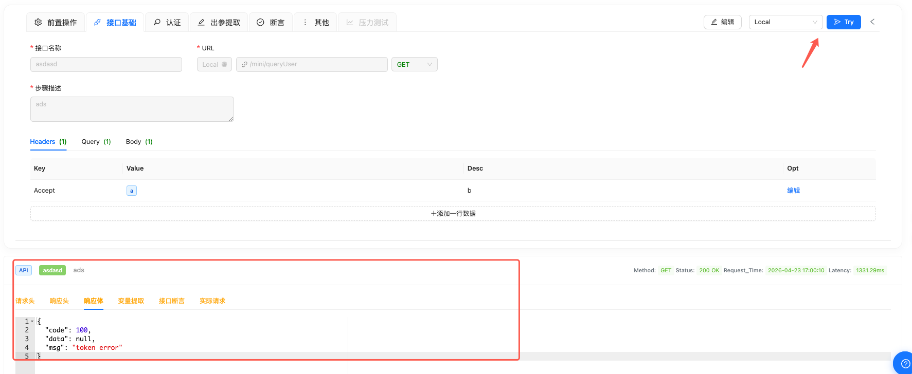

### API 业务流

业务流列表

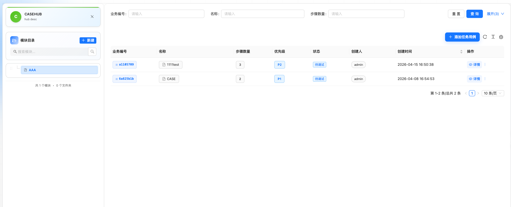

支持引用公共 API、添加私有 API、引用 API 组、添加逻辑判断、脚本执行、等待等。

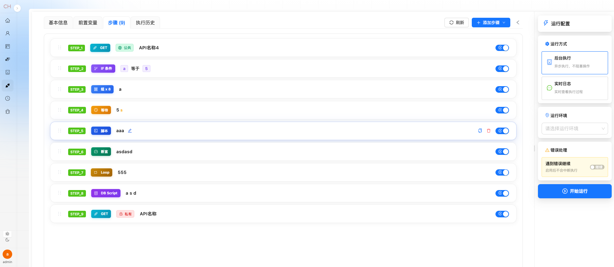

### RunCase 调试

支持同步执行和后台执行，实时展示测试日志。
展示业务步骤的详细执行结果。

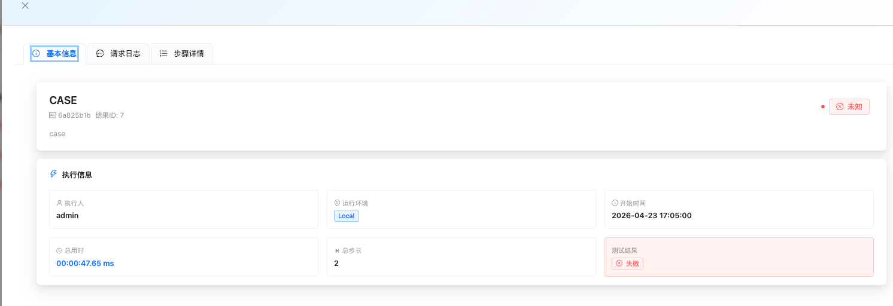
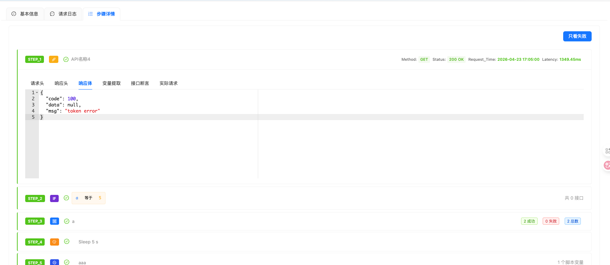

### 业务步骤日志

展示业务步骤的详细执行日志。

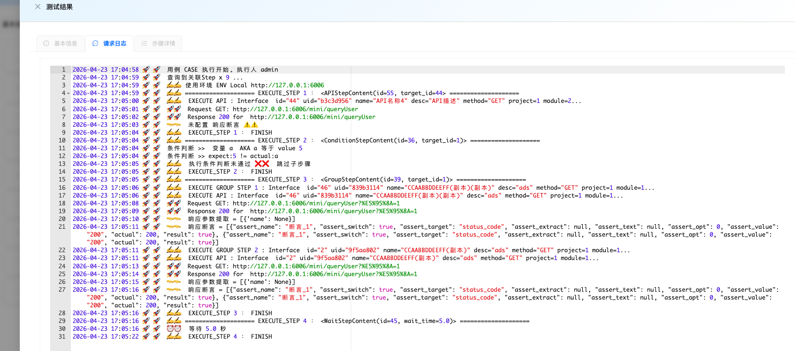

### Task 接口任务

任务列表

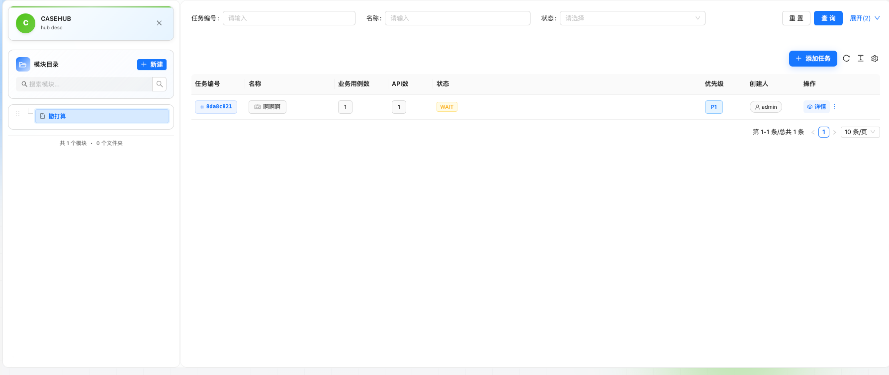

任务可关联多个 API 用例、业务流程用例

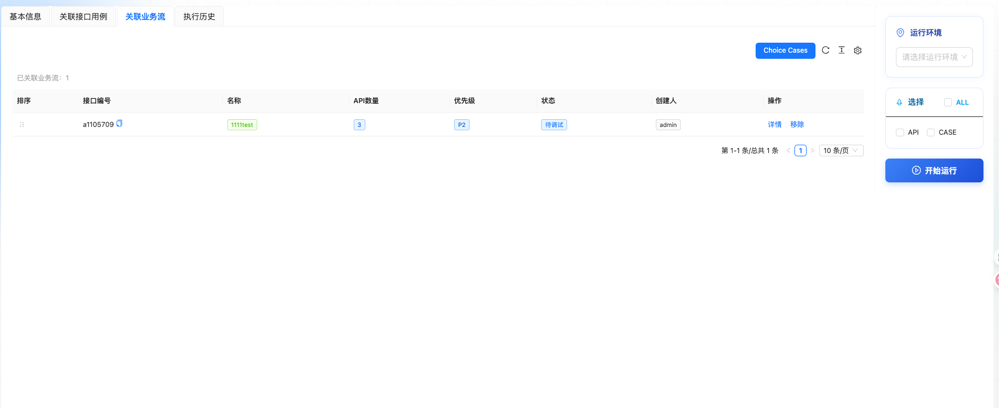

### Task 任务报告

生成并展示任务执行后的详细报告。

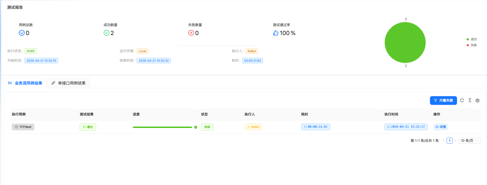

### UI 自动化

支持配置方法、环境、公共步骤、操作任务的调度，支持步骤拖拽排序。


### 脑图功能

集成脑图功能用于测试用例编写。

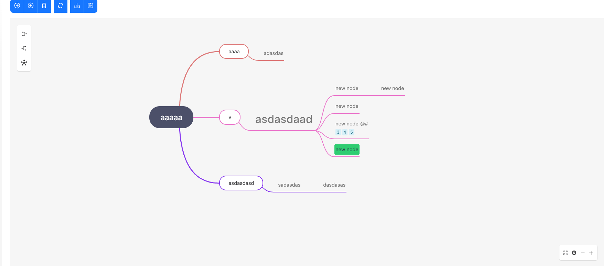

### 业务步骤详情结果

### Job 管理

任务与定时任务分离，支持任务池管理。

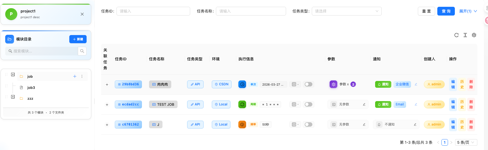

---

## 用例与需求管理

添加需求-管理测试用例

### 需求表

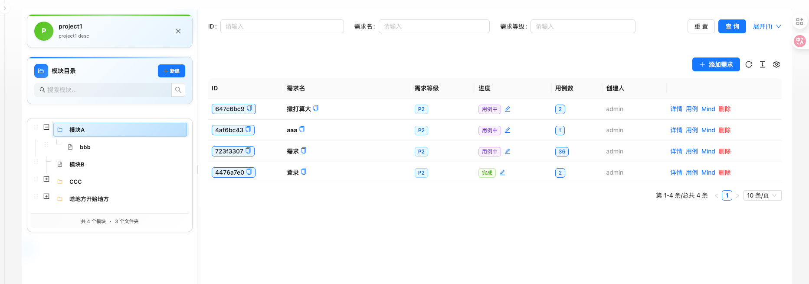

### 需求用例

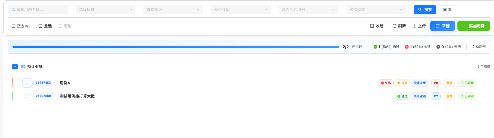

### 用例详情

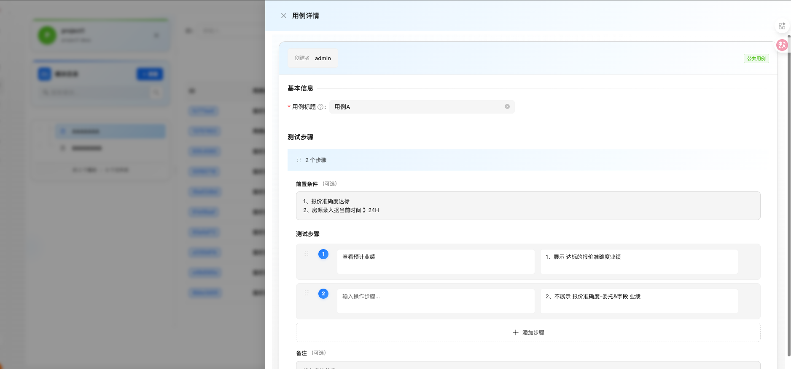

---

## 配置说明

### 数据库配置

```python
# MySQL 配置
MYSQL_SERVER = "127.0.0.1"
MYSQL_PORT = 3306
MYSQL_PASSWORD = "your_password"
MYSQL_DATABASE = 'autoHub'

# 异步 MySQL 连接
ASYNC_SQLALCHEMY_URI = f'mysql+aiomysql://root:{MYSQL_PASSWORD}@{MYSQL_SERVER}:{MYSQL_PORT}/{MYSQL_DATABASE}'
```

### Redis 配置

```python
# Redis 配置
REDIS_SERVER = "127.0.0.1"
REDIS_PORT = 6379
REDIS_DB = 0
REDIS_URL: str = f"redis://{REDIS_SERVER}:{REDIS_PORT}/{REDIS_DB}"

# Redis Broker（用于 Celery）
REDIS_Broker: str = f"redis://{REDIS_SERVER}:{REDIS_PORT}/1"
REDIS_Backend: str = f"redis://{REDIS_SERVER}:{REDIS_PORT}/2"
```

### UI 自动化配置

```python
# UI 自动化配置
INIT_PLAY_BROWSER = False  # 是否初始化浏览器
UI_Headless = True          # 是否使用无头模式
UI_Timeout = 10000          # 超时时间（毫秒）
UI_SLOW = 500               # 慢动作延迟（毫秒）
```

### 定时任务配置

```python
# 定时任务配置
APS = False  # 是否开启定时任务
APS_TZ = pytz.timezone('Asia/Shanghai')  # 时区

# Redis JobStore
APSJobStores = {
    'default': RedisJobStore(
        db=1,
        jobs_key='apscheduler.jobs',
        run_times_key='apscheduler.run_times',
        host=REDIS_SERVER,
        port=REDIS_PORT,
        password=None
    )
}
```

### 任务池配置

```python
# 任务池配置
TASK_WORKER_POOL_SIZE = 10  # 工作线程池大小
REDIS_WORKER_POOL_BD = 10   # Redis 工作池数据库
```

### 通知配置

```python
# 企业微信配置
WeChatBaseUrl = "https://qyapi.weixin.qq.com/cgi-bin/webhook/send"

# 邮件配置
Email_Sender_Username = "your_email@163.com"
Email_Sender_Password = "your_password"
Smtp_Server = "smtp.163.com"
Smtp_port = 578
```

---

## 更新日志

### 2026-04-23

- 重构接口存储策略
- 其他优化若干
- 优化 UI


### 2026-04-02

- 前端代码通过 AI 样式重构设计
- 用例管理重构优化

### 2026-02-28

- UI 重构合并
- 若干优化

### 2026-01-26

- 接口运行拆分重构
- 接口添加执行器 LOOP

### 2025-12-15

- Task 与定时任务分离（API 大致完成）
- 新增 JOB 模型
- 新增任务池
- 重写 APScheduler

### 2025-11-28

- 业务步骤详情结果展示优化
- 日志优化（优化了些细节）

### 2025-11-20

- 增加指定（api、case、task）环境运行能力

### 2025-10-30

- 步骤等待、脚本录入能力

### 2025-10-24

- 接口用例执行重构
- 若干数据库字段更改
- 接口执行调整
- 添加步骤变量判断能力

### 2025-09-17

- 测试用例能力
  - 添加了用例的基本增删改查
  - 复制、拖拽等
  - 用例动态生成
  - 关联需求
  - 用例库

### 2025-08-05

- 新增用例管理 CRUD

### 2025-07-25

- UI 自动化进行了重写
- 接口执行使用了接口功能、不在自定义
- 添加了 UI 组能力执行
- 整体 UI 页面优化

### 2025-05-22

- 集成 Locust 压测（半成品）
- 待完成：数据记录、断言、变量等

### 2025-05-16

- 断言重构
- 支持 JMESPath
- 支持变量断言
- UI 重构

### 2025-03-07

- 优化前端代码、接口修改操作优化
- 添加 DB 链接测试接口

---

## 贡献指南
持续更新中、存在的BUG 多多 🤦 

欢迎贡献代码、提出问题或建议！

1. Fork 本仓库
2. 创建特性分支 (`git checkout -b feature/AmazingFeature`)
3. 提交更改 (`git commit -m 'Add some AmazingFeature'`)
4. 推送到分支 (`git push origin feature/AmazingFeature`)
5. 开启 Pull Request

---

## 联系我

如果您有任何问题或建议，欢迎通过以下方式联系我：

- 微信：
- GitHub Issues：[提交问题](https://github.com/Caoyongqi912/case_auto_hub/issues)

---

<div align="center">

**如果觉得这个项目对您有帮助，请给我们一个 Star！**

</div>
