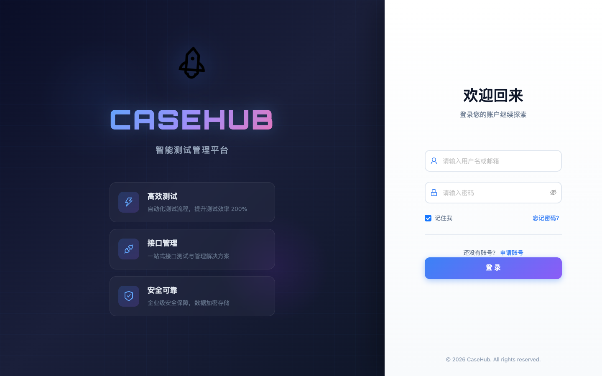

# P0 修复后启动冒烟测试

日期: 2026-06-19

## 测试方式

- 工具: Playwright (headless Chromium via 系统 Chrome)
- 目标: `http://localhost:8000/home`
- 状态: HTTP 200, 全量模块 import 通过

## 抓取证据



未登录被前端路由重定向到 `/userLogin?redirect=/home` —— 这符合预期,
与 P0 改动无关 (P0 改的是模型层/流程层/沙箱,没动 auth)。

登录页正常渲染:CASEHUB 标题、智能测试管理平台副标题、登录表单。

## Import 冒烟

10 个 P0 改动过的关键模块全部 import 通过:

| 模块 | 状态 |
| --- | --- |
| `app.model.basic` | OK |
| `app.model.interfaceAPIModel.contents.interfaceCaseContentsModel` | OK |
| `app.model.interfaceAPIModel.interfaceResultModel` | OK |
| `app.model.interfaceAPIModel.interfaceCaseModel` | OK |
| `croe.interface.runner` | OK |
| `croe.interface.writer.result_writer` | OK |
| `croe.interface.executor.interface_executor` | OK |
| `common.httpxClient` | OK |
| `croe.a_manager.script_manager` | OK |
| `utils.variableTrans` | OK |

## 浏览器控制台错误(预期)

```
console.error: Failed to load resource: the server responded with a status of 401 (Unauthorized)
console.error: Warning: [antd: message] Static function can not consume context like dynamic theme.
              Please use 'App' component instead.
console.error: Failed to load resource: the server responded with a status of 401 (Unauthorized)
```

- 401: 未登录访问受保护 API,符合预期
- antd 警告: 与 P0 无关的旧问题,前端 antd message 用法

## 结论

**P0 修复未破坏应用启动/路由/模型加载**。可继续 P1 修复。
